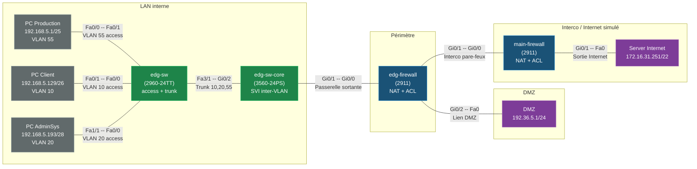

___
### Informations Générales
  
**Auteur :** BISERAY Louis
**Date :** 09/09/2026
**Sujet :** Déploiement d'un serveur Windows Core 2025 

___

## 1. Vue d'ensemble

La maquette **CUB** modélise une architecture réseau d'entreprise segmentée en trois zones de sécurité :

- **LAN interne** (Production, AdminSys, Client) — commuté en VLANs, routé en inter-VLAN sur un commutateur de niveau 3.
- **DMZ** — héberge un serveur exposé (serveur `DMZ`), isolé du LAN par un pare-feu.
- **Accès Internet** — deux pare-feux en cascade (`edg-firewall` puis `main-firewall`) assurant le NAT et le filtrage vers un serveur simulant Internet.



---

## 2. Plan d'adressage IP

| Réseau / VLAN                    | CIDR              | Passerelle     | Interface                                    |
| -------------------------------- | ----------------- | -------------- | -------------------------------------------- |
| VLAN 10 – Client                 | 192.168.5.128/26  | 192.168.5.190  | `edg-sw-core` Vlan10                         |
| VLAN 20 – AdminSys               | 192.168.5.192/28  | 192.168.5.206  | `edg-sw-core` Vlan20                         |
| VLAN 55 – Production             | 192.168.5.0/25    | 192.168.5.126  | `edg-sw-core` Vlan55                         |
| VLAN 2 – Interco cœur ↔ pare-feu | 192.168.55.248/29 | 192.168.55.254 | `edg-sw-core` Vlan2 / `edg-firewall` Gi0/0   |
| DMZ                              | 192.36.5.0/24     | 192.36.5.254   | `edg-firewall` Gi0/2                         |
| Interco pare-feux                | 192.36.253.0/24   | — (P2P)        | `edg-firewall` Gi0/1 ↔ `main-firewall` Gi0/0 |
| Sortie Internet simulée          | 172.16.28.0/22    | 172.16.31.250  | `main-firewall` Gi0/1                        |

### Détail des hôtes

| Hôte | IP | Masque | Passerelle |
|---|---|---|---|
| PC Client | 192.168.5.129 | 255.255.255.192 (/26) | 192.168.5.190 |
| PC AdminSys | 192.168.5.193 | 255.255.255.240 (/28) | 192.168.5.206 |
| PC Production | 192.168.5.1 | 255.255.255.128 (/25) | 192.168.5.126 |
| DMZ | 192.36.5.1 | 255.255.255.0 (/24) | 192.36.5.254 |
| Server Internet | 172.16.31.251 | 255.255.252.0 (/22) | 172.16.31.250 |

---

## 4. Topologie physique (câblage)

| Extrémité A | Port A | Extrémité B | Port B |
|---|---|---|---|
| PC Production | FastEthernet0 | edg-sw-core | FastEthernet0/1 |
| edg-sw-core | GigabitEthernet0/1 | edg-firewall | GigabitEthernet0/0 |
| edg-firewall | GigabitEthernet0/2 | DMZ | FastEthernet0 |
| edg-firewall | GigabitEthernet0/1 | main-firewall | GigabitEthernet0/0 |
| main-firewall | GigabitEthernet0/1 | Server Internet | FastEthernet0 |
| edg-sw-core | GigabitEthernet0/2 | edg-sw | FastEthernet3/1 (trunk) |
| edg-sw | FastEthernet0/1 | PC Client | FastEthernet0 |
| edg-sw | FastEthernet1/1 | PC AdminSys | FastEthernet0 |

---

## 5. Configurations commentées

### 5.1 `edg-sw` — Commutateur d'accès (2960-24TT, substitut de Switch-PT)

```plaintext
hostname edg-sw
!
interface FastEthernet0/1
 switchport access vlan 10
 switchport mode access
! Port d'accès dédié au poste "PC Client" -> VLAN 10 (utilisateurs).
!
interface FastEthernet1/1
 switchport access vlan 20
 switchport mode access
! Port d'accès dédié au poste "PC AdminSys" -> VLAN 20 (administration).
!
interface FastEthernet3/1
 switchport trunk allowed vlan 10,20,55
 switchport mode trunk
! Lien montant (uplink) vers edg-sw-core.
! Trunk 802.1Q autorisant uniquement les VLANs utiles (10, 20, 55)
! -> limite la propagation du broadcast aux VLANs réellement utilisés.
!
```

### 5.2 `edg-sw-core` — Commutateur cœur L3 (3560-24PS)

```plaintext
hostname edg-sw-core
!
ip routing
! Active le routage IP sur le commutateur L3 : indispensable pour
! que les interfaces virtuelles (SVI / VLAN) puissent router
! le trafic inter-VLAN.
!
interface FastEthernet0/1
 switchport access vlan 55
 switchport mode access
! Port d'accès pour "PC Production" -> VLAN 55.
!
interface GigabitEthernet0/1
 switchport access vlan 2
 switchport mode access
! Lien point-à-point vers edg-firewall, isolé dans son propre VLAN (2)
! -> évite de mélanger le trafic d'interconnexion avec le LAN utilisateur.
!
interface GigabitEthernet0/2
 switchport trunk allowed vlan 10,20,55
 switchport trunk encapsulation dot1q
 switchport mode trunk
! Lien descendant (downlink) vers edg-sw, en trunk 802.1Q,
! transporte les 3 VLANs utilisateurs.
!
interface Vlan2
 ip address 192.168.55.253 255.255.255.248
! SVI d'interconnexion avec edg-firewall (réseau /29 dédié).
!
interface Vlan10
 description Passerelle Vlan Client
 ip address 192.168.5.190 255.255.255.192
! Passerelle par défaut du VLAN 10 (Client) — /26.
!
interface Vlan20
 description Passerelle Vlan AdminSys
 ip address 192.168.5.206 255.255.255.240
! Passerelle par défaut du VLAN 20 (AdminSys) — /28.
!
interface Vlan55
 description Passerelle Vlan Production
 ip address 192.168.5.126 255.255.255.128
! Passerelle par défaut du VLAN 55 (Production) — /25.
!
ip route 0.0.0.0 0.0.0.0 192.168.55.254
! Route par défaut : tout trafic non-local est envoyé vers
! edg-firewall (192.168.55.254, interface Gi0/0 côté pare-feu).
```

### 5.3 `edg-firewall` — Pare-feu périmétrique (2911)

```plaintext
hostname edg-firewall
!
interface GigabitEthernet0/0
 description Chemin sortant
 ip address 192.168.55.254 255.255.255.248
 ip nat inside
! Interface côté LAN (réseau d'interco avec edg-sw-core).
! Déclarée "nat inside" : trafic considéré comme interne au NAT.
!
interface GigabitEthernet0/1
 description Chemin entrant
 ip address 192.36.253.50 255.255.255.0
 ip nat outside
! Interface côté "extérieur" (vers main-firewall) : "nat outside".
!
interface GigabitEthernet0/2
 description Lien DMZ
 ip address 192.36.5.254 255.255.255.0
! Interface vers la DMZ. Pas de NAT dessus : la DMZ est gérée
! séparément (accès direct + ACL de filtrage, voir plus bas).
!
ip nat inside source list 1 interface GigabitEthernet0/1 overload
! NAT dynamique avec surcharge (PAT / "overload") : toutes les IP
! internes autorisées par l'ACL 1 sont traduites vers l'IP publique
! de Gi0/1 (192.36.253.50).
!
ip route 0.0.0.0 0.0.0.0 192.36.253.254
ip route 0.0.0.0 0.0.0.0 192.168.55.253
! Deux routes par défaut : une vers l'extérieur (192.36.253.254,
! non utilisée ici car main-firewall est le vrai relais), une vers
! le cœur de réseau LAN (192.168.55.253 = edg-sw-core, VLAN2).
!
access-list 1 deny host 192.36.5.1
access-list 1 permit 192.168.5.0 0.0.0.255
! ACL 1 (utilisée par le NAT) :
!  - refuse explicitement le serveur DMZ (192.36.5.1) -> il ne doit
!    jamais être traduit/masqué en sortie (règle de séparation DMZ/LAN).
!  - autorise l'ensemble du LAN 192.168.5.0/24 à sortir via NAT.
! ATTENTION : le masque générique 0.0.0.255 couvre 192.168.5.0/24,
! ce qui englobe bien les 3 sous-réseaux VLAN (10, 20, 55) puisqu'ils
! sont tous inclus dans ce bloc /24.
```

### 5.4 `main-firewall` — Pare-feu de sortie Internet (2911)

```plaintext
hostname main-firewall
!
interface GigabitEthernet0/0
 description Liaison Entrant
 ip address 192.36.253.254 255.255.255.0
 ip nat inside
! Interface côté edg-firewall (réseau d'interco 192.36.253.0/24).
!
interface GigabitEthernet0/1
 description Liaison Sortant Internet
 ip address 172.16.31.250 255.255.252.0
 ip nat outside
! Interface côté "Internet" (simulé par Server Internet).
!
ip nat inside source list 1 interface GigabitEthernet0/1 overload
! PAT : masque le trafic entrant depuis edg-firewall derrière
! l'IP publique 172.16.31.250.
!
ip route 0.0.0.0 0.0.0.0 192.36.253.50
! Route par défaut vers edg-firewall (Gi0/1, 192.36.253.50) pour
! le retour du trafic — cohérent avec le NAT déjà appliqué en amont.
!
access-list 1 deny host 192.36.5.1
access-list 1 permit host 192.36.253.50
! ACL 1 : refuse toujours le serveur DMZ, autorise uniquement
! l'adresse de edg-firewall (déjà elle-même NATée en amont)
! -> filtrage strict : seul le pare-feu périmétrique peut sortir
!    vers Internet via main-firewall.
```

### 5.5 Postes et serveurs

```plaintext
# PC Production   : 192.168.5.1/25    GW 192.168.5.126   (VLAN 55)
# PC Client        : 192.168.5.129/26  GW 192.168.5.190   (VLAN 10)
# PC AdminSys      : 192.168.5.193/28  GW 192.168.5.206   (VLAN 20)
# DMZ              : 192.36.5.1/24     GW 192.36.5.254     + DHCP 192.36.5.0/24
# Server Internet  : 172.16.31.251/22  GW 172.16.31.250    + DHCP 172.16.28.0/22
```
*(Adressage statique saisi directement dans les propriétés IP de chaque hôte/serveur ; pas de commandes CLI associées côté PC-PT/Server-PT.)*

---

## 6. Logique de sécurité et de flux

1. **Trois VLANs utilisateurs isolés** (10 = Client, 20 = AdminSys, 55 = Production), routés uniquement via les SVI de `edg-sw-core`.
2. **Double NAT en cascade** : le LAN sort via `edg-firewall` (PAT sur 192.36.253.50), puis re-NAT via `main-firewall` (PAT sur 172.16.31.250) avant d'atteindre le serveur Internet simulé.
3. **DMZ non NATée et exclue explicitement du NAT sortant** (`access-list 1 deny host 192.36.5.1` sur les deux pare-feux) : le serveur DMZ ne doit jamais emprunter la même règle de sortie que le LAN, sous risque de ne pas être joignable.
4. **Trunks restreints** aux VLANs strictement nécessaires (`allowed vlan 10,20,55`), plutôt que d'autoriser tous les VLANs par défaut.

